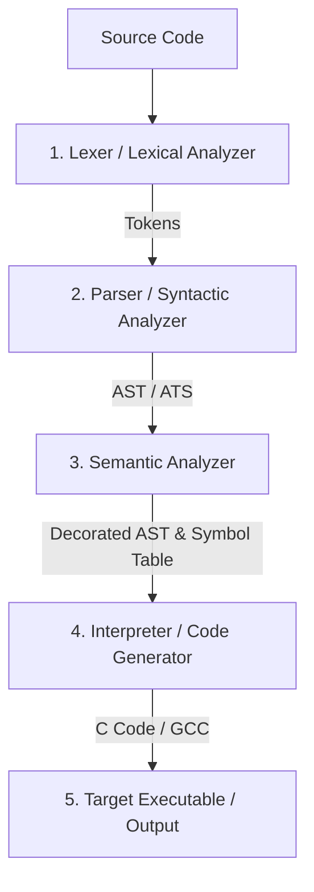

# Comp

Project built with [Gini](https://gini-webserver.up.railway.app/)

Welcome to **Comp**, an educational compiler project written in Go. The goal of this project is to demystify how compilers work by building one from scratch, showing every phase of the translation pipeline from source code to executable machine code (via C/GCC).

>All of this wouldn't be possible if it weren't for this guy, [Tlaceby](https://github.com/tlaceby/parser-series/tree/main), and my college's old books and slides.
---

## The Compilation Pipeline

A compiler is a program that translates source code written in a high-level programming language into another language (often low-level machine code or intermediate representations). This process is divided into several well-defined phases:



Below is a detailed breakdown of each step, including its meaning, what it does, code/conceptual examples, and suggested study topics.

---

## 1. Lexer (Lexical Analysis / Scanner)

### Meaning
The **Lexer** (short for Lexical Analyzer) is the first phase of a compiler. It reads the raw stream of characters representing the source code and groups them into meaningful sequences called **Tokens** while discarding trivia like whitespace, tabs, and comments.

### What it Does
- Scans the source file character by character.
- Recognizes patterns (using regular expressions or state machines) that form words of the language.
- Produces a stream of **Tokens** (e.g., `IDENTIFIER`, `NUMBER`, `PLUS`, `ASSIGN`, `IF`, `EOF`).
- Tracks metadata like line and column numbers for error reporting.

### Example
**Source Input:**
```c
let x = 5 + 10;
```

**Lexer Output (Token Stream):**
```go
[]Token{
    {Type: TOKEN_LET,     Literal: "let",  Line: 1, Column: 1},
    {Type: TOKEN_IDENT,   Literal: "x",    Line: 1, Column: 5},
    {Type: TOKEN_ASSIGN,  Literal: "=",    Line: 1, Column: 7},
    {Type: TOKEN_INT,     Literal: "5",    Line: 1, Column: 9},
    {Type: TOKEN_PLUS,    Literal: "+",    Line: 1, Column: 11},
    {Type: TOKEN_INT,     Literal: "10",   Line: 1, Column: 13},
    {Type: TOKEN_SEMICOLON,Literal: ";",   Line: 1, Column: 15},
    {Type: TOKEN_EOF,     Literal: "",     Line: 1, Column: 16},
}
```

### Study Topics
*   **Regular Expressions (Regex):** Used to define patterns for tokens (e.g., numeric literals, identifiers).
*   **Finite Automata:** Finite State Machines (DFAs and NFAs) used to recognize lexical patterns efficiently.
*   **Lexer Generators:** Tools like `lex`, `flex`, or Go's `golex`.
*   **Buffer Management:** Handling large source files efficiently using sliding windows or double buffering.

---

## 2. Parser (Syntactic Analysis)

### Meaning
The **Parser** takes the flat sequence of tokens generated by the Lexer and determines whether they form valid sentences according to the grammar rules of the programming language.

### What it Does
- Validates the syntax of the token stream.
- Implements the grammar rules (syntax rules) of the language.
- Organizes the tokens into a hierarchical tree structure, typically an **Abstract Syntax Tree (AST)**.
- Reports syntax errors (e.g., mismatched parentheses, missing semicolons).

### Example
For the statement `let x = 5 + 10;`, the parser matches it against the rule:
`VariableDeclaration -> "let" Identifier "=" Expression ";"`

It parses the expression `5 + 10` recursively, recognizing the operator precedence (addition) and groups them as a binary expression node.

### Study Topics
*   **Context-Free Grammars (CFGs):** Formal notations like Backus-Naur Form (BNF) or Extended BNF (EBNF) used to define programming language syntax.
*   **Parsing Algorithms:**
    *   *Top-down Parsers:* Recursive Descent Parsers, LL(k) parsers.
    *   *Bottom-up Parsers:* LR, LALR, SLR parsers (often used by parser generators).
*   **Pratt Parsing (Top-Down Operator Precedence):** A clean and highly readable hand-written parsing technique ideal for parsing expressions and binary operators.
*   **Parser Generators:** Tools like `yacc`, `bison`, or `goyacc`.

---

## 3. AST / ATS (Abstract Syntax Tree)

### Meaning
The **AST** (Abstract Syntax Tree, sometimes referred to as ATS / Abstract Syntax Structure) is a hierarchical, tree-like data structure that represents the logical syntactic structure of the source code. Unlike a Concrete Syntax Tree (Parse Tree), the AST omits syntactic sugar and punctuation details (like parentheses, commas, or semicolons) and focuses purely on the semantics of the structure.

### What it Does
- Acts as the central intermediate representation (IR) of the program structure.
- Represents expressions, statements, declarations, and control flow in a nested tree structure.
- Serves as the primary structure traversed by the Semantic Analyzer, Interpreter, and Code Generator.

### Example
In Go, an AST node representing the variable declaration `let x = 5 + 10;` might look like:

```go
type LetStatement struct {
    Token Token      // The 'let' token
    Name  *Identifier // Node representing 'x'
    Value Expression  // Node representing '5 + 10'
}

type InfixExpression struct {
    Token    Token      // The '+' token
    Left     Expression // Node representing '5'
    Operator string     // "+"
    Right    Expression // Node representing '10'
}
```

**Visual Tree Representation:**
```
     LetStatement (Name: x)
              |
       InfixExpression (+)
          /        \
   Integer(5)    Integer(10)
```

### Study Topics
*   **Tree Traversal Algorithms:** Depth-First Search (DFS), Pre-order, Post-order, and In-order traversals of AST nodes.
*   **Design Patterns (Visitor Pattern):** A design pattern commonly used in object-oriented languages to write clean, modular compiler passes (like type checking or codegen) without modifying the AST node classes/structs.
*   **AST Node Modeling in Go:** Leveraging Go interfaces (`Node`, `Statement`, `Expression`) to build a type-safe tree hierarchy.

---

## 4. Semantic Analyser (Contextual Analysis)

### Meaning
The **Semantic Analyzer** inspects the AST to ensure the program makes sense and follows the semantic rules of the language that cannot be easily verified by the context-free grammar of the parser.

### What it Does
- **Scope Resolution:** Ensures variables, functions, and types are declared before use, and handles variable scoping rules.
- **Type Checking:** Verifies that operators are applied to compatible types (e.g., you cannot add a string to an integer, or assign a float to a boolean variable).
- **Symbol Table Construction:** Maintains a "Symbol Table" containing information about declarations, scopes, types, and variables.
- **Control Flow Analysis:** Ensures functions return values where required, and keywords like `break` or `continue` are only used inside loops.

### Example
Suppose we have the following code snippet:
```c
let x = 5;
let y = x + "hello"; // Semantic Error!
```
*   **Lexer** successfully tokens it (all characters are valid).
*   **Parser** successfully parses it (matches `VariableDeclaration` syntax).
*   **Semantic Analyzer** looks up the type of `x` (integer) and the literal `"hello"` (string), checks the operator `+` rule, and throws a compile-time semantic error: `Type Mismatch: cannot add int and string`.

### Study Topics
*   **Symbol Tables (Environment):** Designing scoping mechanisms (lexical scope, dynamic scope, nested environments).
*   **Type Systems:** Static vs dynamic typing, type inference (e.g., Hindley-Milner type inference), type coercion, and type safety.
*   **Attribute Grammars:** Formalisms for assigning semantic values (attributes) to the nodes of the syntax tree.

---

## 5. Interpreter / Builder (Codegen & GCC Compilation)

### Meaning
The **Interpreter** or **Code Generator (Builder)** is the final backend phase.
- An **Interpreter** directly executes the AST node-by-node or compiles it to virtual machine bytecode to execute it on the fly.
- A **Code Generator (Builder)** translates the AST into a target language (like C, assembly, or LLVM IR). This output is then compiled into a final native executable using an external toolchain, such as **GCC** or **Clang**.

### What it Does
- Traversing the decorated AST.
- If **building (compiling)**:
    1. Emits equivalent C code or Assembly instructions from each AST node.
    2. Writes the generated code to a file (e.g., `output.c`).
    3. Invokes an external compiler (like `gcc`) via system commands to build the executable binary.
- If **interpreting**:
    1. Evaluates expressions on the fly using runtime variables/environment.
    2. Produces immediate execution results.

### Example (C Code Generation)
For the AST of `let x = 5 + 10;`, the Code Generator translates it to:

```c
#include <stdio.h>

int main() {
    int x = 5 + 10;
    return 0;
}
```

Then, the compiler invokes GCC under the hood:
```bash
gcc output.c -o myprogram
```

### Study Topics
*   **Target Code Generation:** Emitting machine code, intermediate C code, or Assembly (x86_64, ARM).
*   **Intermediate Representation (IR):** 3-Address Code (3AC), Static Single Assignment (SSA) form, or LLVM IR.
*   **Compiler Optimization:** Constant folding, loop unrolling, dead code elimination, register allocation.
*   **Runtime Systems & Memory Management:** Garbage collection, stack frames, heap allocation.